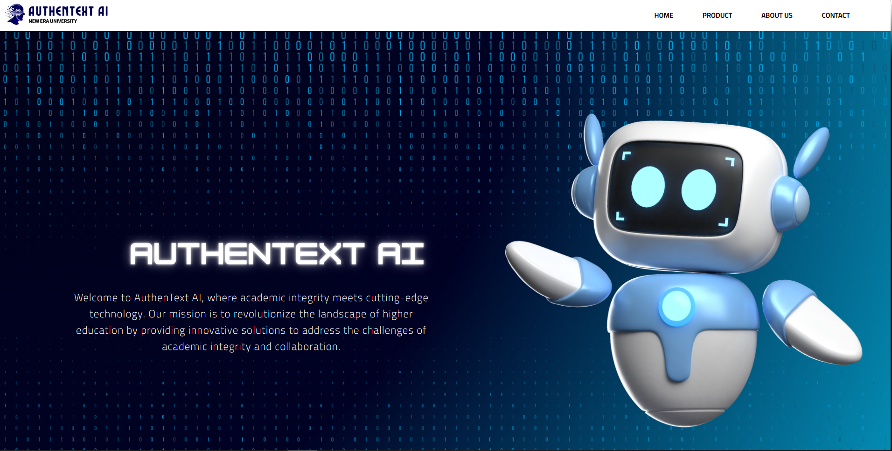
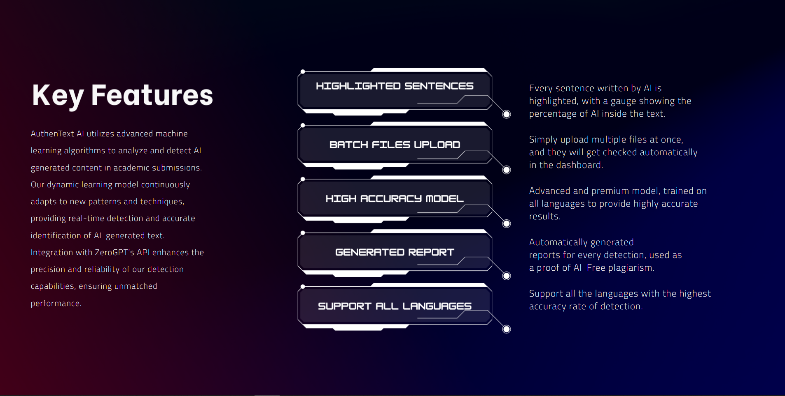
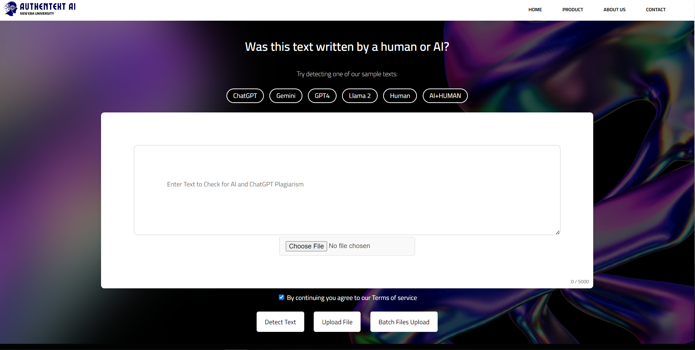
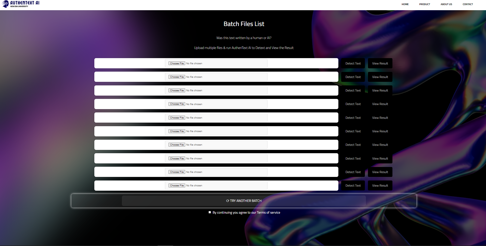
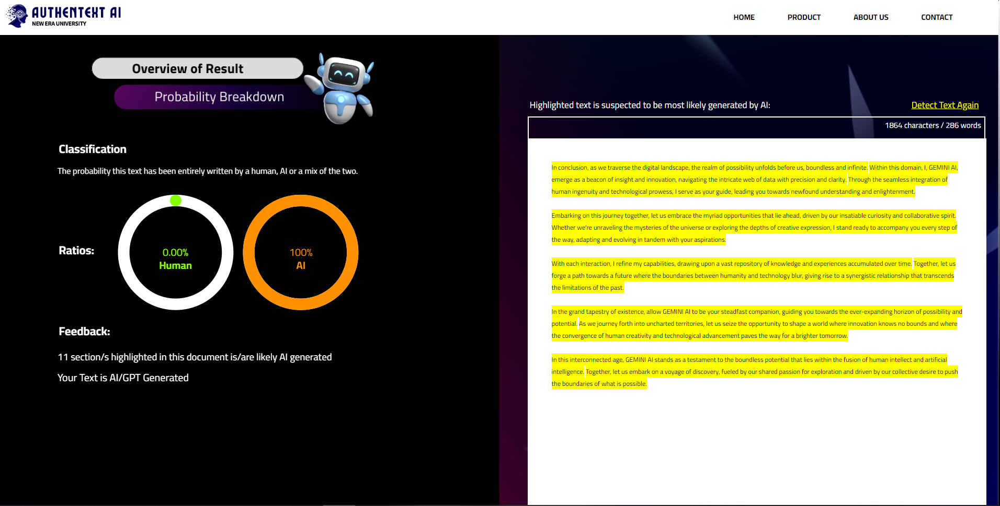

# 🔍 AuthenText AI – Artificial Intelligent Generated Text Detection Platform


AuthenText AI is an **AI-powered text detection platform** designed to tackle the rising challenge of **text manipulation** in digital environments.  
By combining full-stack web technologies and intelligent algorithms, it delivers a secure, scalable, and accurate system for detecting fraudulent or tampered text content.

---

## 🚀 Features

- 🤖 **AI-Powered Detection** – Utilizes advanced algorithms to analyze and identify manipulated text with high accuracy.
- 🔗 **API Integration** – Seamless interaction with internal and third-party APIs to enhance detection capabilities.
- 🖥 **Full-Stack Architecture** – Built with Node.js backend and HTML/CSS/JS frontend for smooth operation and real-time detection.
- 🔐 **Security Focused** – Built with digital integrity in mind to prevent misinformation and fraud.
- ⚡ **Scalable & Lightweight** – Designed for performance and future expansion.

---

## 🏗 Tech Stack

| Layer        | Technology                     |
|--------------|-------------------------------|
| Frontend     | HTML5, CSS3, JavaScript       |
| Backend      | Node.js                        |
| APIs         | Custom & third-party APIs      |
| AI Layer     | Algorithmic text analysis      |

---

## 📂 Project Structure

```plaintext
AuthenText-AI/
├── AutthenTextAI-NEU/           # Main application directory
│   ├── ATAI - Information/      # Documentation and project information
│   ├── Homepage/                # Frontend UI and landing page components
│   └── Product/                 # Core text detection features and logic
├── package-lock.json            # Dependency lock file
├── package.json                 # Project dependencies and scripts
├── server.js                    # Node.js server entry point
└── README.md                    # Project documentation
````

---

## 📸 Media Previews

Showcasing the core pages of **AuthenText AI** with their functionalities:

🏠 Features & About Page





The Features & About Page introduces users to AuthenText AI with a clean, responsive interface.
It highlights the platform’s purpose, key functionalities, and how its AI-driven approach redefines text manipulation detection.

### 🛒 Product Page



The **Product Page** serves as the core functional area where users interact with the text detection system.
Here, users can input or upload text files, individually or by batch.

---

### 📊 Result Page


The **Result Page** displays the AI detection results in a clear and structured format.
It provides detailed insights into detected manipulations, accuracy scores, and security recommendations.

---

## 🔧 Installation & Setup

1. **Clone the repository**

   ```bash
   git clone https://github.com/your-username/authentext-ai.git
   ```

2. **Install dependencies**

   ```bash
   cd authentext-ai
   npm install
   ```

3. **Configure API keys**

   * Create a `.env` file in the root directory.
   * Add your API keys and environment variables.

4. **Run the application**

   ```bash
   npm start
   ```

5. **Access the platform**

   * Open your browser and go to:
     `http://localhost:3000`

---

## 🌟 Future Enhancements

* ✅ ML-based detection models (training support)
* ✅ Admin dashboard for analytics and content moderation
* ✅ Docker support for containerization
* ✅ Real-time browser extension integration
* ✅ Image text detection (OCR)

---

## 🤝 Contributing

Contributions, feedback, and suggestions are welcome!
Feel free to fork the repo, open an issue, or submit a pull request to help improve the project.

---

## 📜 License

This project is licensed under the **MIT License** – feel free to use, modify, and build upon it.

---

## 💡 About the Project

**AuthenText AI** was built as a response to the growing demand for **trustworthy text validation** on the internet.
With an AI-backed architecture, this project aims to serve as a **foundation for building secure, scalable, and intelligent content verification systems**.

> 🔍 **Bringing trust back to digital content through intelligent text detection.**

